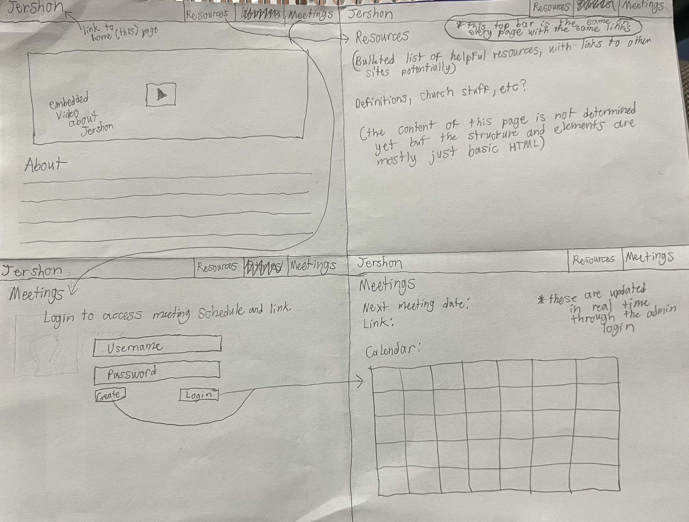

# CS 260 Startup
[Notes File](notes.md)

## Specification Deliverable
(updated 9/27/24)
### Elevator Pitch
The August 2024 updates to the General Handbook of the Church of Jesus Christ of Latter-day Saints was injurious to transgender members. Trans members already struggle to find a place of belonging within the Church, but these policies have removed many of the small things that trans members had that helped them feel welcome. The goal of this website is to provide resources that help trans latter-day saints navigate this difficult space, as well as provide a way for them to connect with other trans members online.

### Key features
- Secure login over HTTPS
- Calendar and online meeting links displayed with updates in realtime
- Persistent storage of users and events
- Nicely-styled pages of helpful information and resources
### Design

### Technologies
I am going to use the required technologies in the following ways.
- **HTML** - My HTML will set up the structure for my webpages, which include a home/about page, a stories page, a resources page, and pages for logging in to access the meeting and calendar page. I'll display images and video throughout the website.
- **CSS** - I will use CSS to create professional-looking styling for the organization.
- **React** - JavaScript and React will help the website work together coherently and display videos and events.
- **Service** - Backend service with endpoints for login and retrieving events and meeting links. Potentially using a public API for calendar set-up.
- **DB/Login** - Save users and events
- **WebSocket** - As the events and links are updated by the administrators, this is broadcast to all other users.

### HTML Deliverable
I used HTML for the structure of my website.
- Four HTML pages for the home/about page, resources, meetings/calendar, and login.
- The header and footer are the same for each page, with the header linking between pages and the footer linking to my GitHub repository.
- The header contains a relevant image.
- There are placeholders for login (login.html) and displaying the username (the header on each page).
- The textual content for the homepage is added, as well as headings and placeholder content on the other pages.
- The calendar represents data from the database.
- The calendar and meeting links will be updated in realtime using WebSocket.

### CSS Deliverable
I used CSS to style my application.
- Each page contains a header, footer, and body for the content.
- There are navigation elements contained in the header, and I changed the color of the links to match my website's theme.
- Responsive to window sizing: My application resizes and fits onto all screen sizes.
- Application elements: Color theme, fixed header and footer, spacing
- Application text content: Consistent font family and easy-to-read text
- Application images: Rounded the image corners

### React Deliverable
I used React to tie my application together.
- Bundled using Vite: I did this
- Multiple react components: The home page links to the other pages. The header and footer are separate components that repeat on each page. On the login pages, the user can press submit to navigate to the meetings page.
- Router: I used the router to navigate between pages.
- Hooks: I used the useNavigate hook on login.jsx to navigate to the meetings page.

### Service Deliverable
- HTTP service with node.js and express: done
- Frontend served up using Express static middleware: done
- Frontend calls third-party API: generates a random cat photo every time the resources page is loaded
- Backend provides endpoints: api router with attendance in index.js
- Frontend calls endpoints: information sent and displayed in meetings.jsx

### DB/Login Deliverable
- Supports new user registration: Yes (on login page)
    - will not create a new user if the username is already taken
- Supports existing user authentication and logout: Yes 
    - logout button on meetings page
    - will not login if the username/password is incorrect
- Stores application data in MongoDB: Yes
- Stores and retrieves credentials in MongoDB: Yes
- Restricts application functionality based upon authentication: Yes (can't access meetings page until you log in)